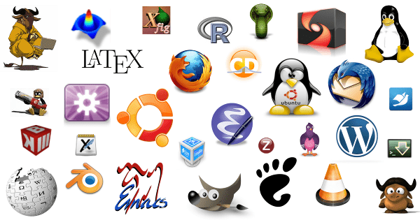
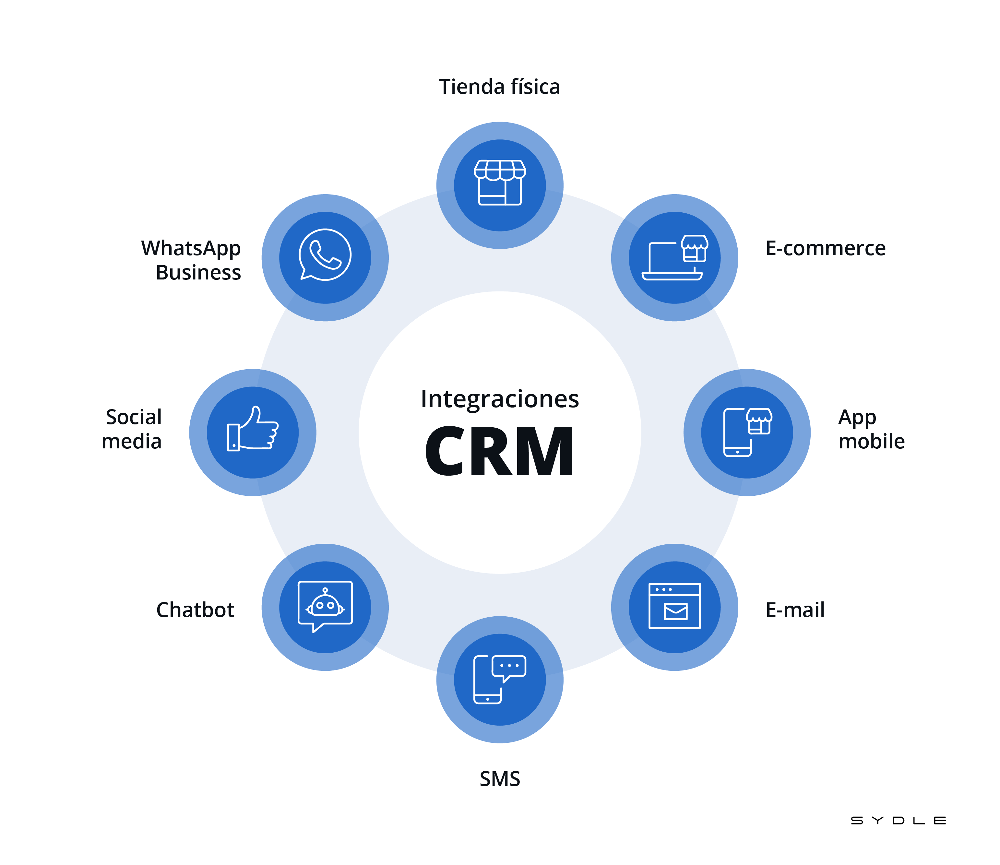
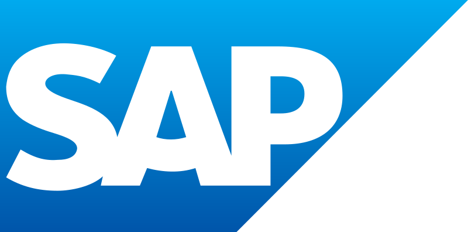

<h1>Actividades dossier Tema 11</h1>

Adonay González Gutiérrez 1º DAM

<h1> Indice </h1>

- [Practica 1](#practica-1)
  - [Sofware Libre](#sofware-libre)
  - [Sistenas de Gestion Empresarial](#sistenas-de-gestion-empresarial)
  - [SAP en España](#sap-en-españa)
    - [¿Que es SAP?](#que-es-sap)
- [Practica 2](#practica-2)
  - [CMS](#cms)

# Practica 1
Lee los artículos que acompañan a este tema.
- **Artículo 01** – sobre software libre.
- **Artículo 02** – sobre sistemas de gestión empresarial.
- **Artículo 03** – posicionamiento de SAP en España.

Realiza un pqueño de resumen de cada uno de ellos.
## Sofware Libre
 **Software libre** es el software que respeta la libertad de los usuarios y la comunidad. A grandes rasgos, significa que los usuarios tienen la libertad de ejecutar, copiar, distribuir, estudiar, modificar y mejorar el software. Es decir, el **software libre** es una cuestión de libertad, no de precio.
 

## Sistenas de Gestion Empresarial
**ERP** son  sistemas de planificación de recursos empresariales son sistemas de gestión de información que automatizan muchas de las prácticas de negocio asociadas con los aspectos operativos o productivos de una empresa.
Los objetivos principales de los sistemas ERP son:

- Unificación y trazabilidad de todos los procesos en un mismo sistema.
- Optimización de los procesos empresariales.
- Planificación de los recursos.
- Automatización de los procesos entre las áreas de la empresa.
- Acceso a los datos y creación de información estructurada.
- Posibilidad de compartir información entre todos los componentes de la organización.
- Eliminación de datos y operaciones innecesarias de reingeniería.
  

Por otro la tenemos los **CRM**. Estos sofwares almacenan información de clientes actuales y potenciales (como nombre, dirección, número de teléfono, etc) e identifica sus actividades y puntos de contacto con la empresa. Esto incluye visitas de los clientes al sitio, llamadas telefónicas realizadas, intercambios por correo electrónico y varias otras interacciones. 

Es importante destacar que el sistema CRM no es solo una lista de contactos elaborada, ya que sobre todo, recopila e integra datos valiosos para preparar y actualizar a tus equipos con información personal de los clientes, sus historiales de compra y sus preferencias.

## SAP en España

### ¿Que es SAP?
**SAP** es una empresa multinacional alemana dedicada al diseño de productos informáticos de gestión empresarial, tanto para empresas como para organizaciones y organismos públicos.​ En términos de ventas, SAP es la mayor compañía de software de Europa y la tercera más grande del mundo.

En cuanto a como se pocisiona **SAP** en España tiene un acuato de mercado de un 53% en *ERP* y un 24% en *CRM* lo que la hace la empresa lider en este sector.
Aunque lo datos de la lectura no son actulaes igualente **SAP** sigue en primera posicion es este sector seguido por **Micorsoft Dynamics**.

# Practica 2

Realiza un pequeño documento donde expliques con tus palabras la diferencia
entre un ERP, un CRM, un CMS y una aplicación de E-Learning.

Como en lanterio practica hablamos de lo que es  **ERP y CRM** en este apartado explicaremos un poco lo que es un **CMS** y el **E-Leraning** y de cuales son sus diferencias.

## CMS 