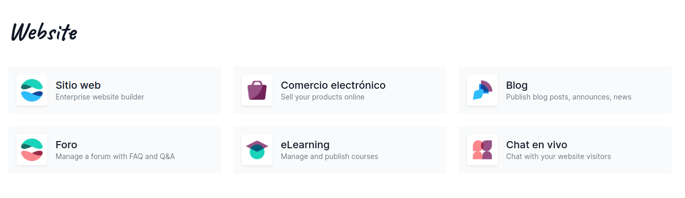

<h1>Trabajo de investigación Odoo</h1>

**Adonay Gonzalez Gutiérrez**

<h1>Indice</h1>

- [Que es Odoo](#que-es-odoo)
- [Para que se usa Odoo](#para-que-se-usa-odoo)
- [Porque usar Odoo](#porque-usar-odoo)
- [Ventajes de Odoo](#ventajes-de-odoo)
- [Desventajas de Odoo](#desventajas-de-odoo)

# Que es Odoo

**¿Qué es Odoo y para que sirve?**

Odoo permite al usuario utilizar bajo una misma plataforma diferentes funcionalidades de software empresarial como CRM, ventas, inventario, informes, contabilidad, envío de facturas, web, e-commerce, e-mail marketing y muchas más. Todas las aplicaciones de Odoo están totalmente integradas y se comunican entre sí.

# Para que se usa Odoo

Odoo como software de gestión empresarial (ERP) se encarga de integrar todas las áreas de tu empresa por medio de módulos o aplicaciones también conocidas como Odoo Apps las cuales se relacionan, facilitan y complementan el proceso de gestión de tu empresa.

En la Captura de pantalla podemos observar todas las aplicacciones que no puedo ofreccer Odoo como ERP. 

# Porque usar Odoo

Tode depende de nuestro modelo de negocio, pero el ambito empresarial esta en constante evolucion y ser una empresa competente hoy en dia es muy complicado, Odoo con sus diferentes te permite bajo un mismo sofware tener todo tipo de aplicaciones que te permiten mejorar, tu modelo de negocio. Odoo posea app para todo tipos de negocios. por ejemplo E-comerce, Paginas Webs ...

Todas estas herramenientas te permiten tener un facil acceso a base de datos, stats sobre ventas y todo lo que quieras implementar para tu negocio.
Odoo cubre todas las necesidades de gestión empresarial a través de los diferentes módulos:

- Inventario
- Ventas
- CRM
- Contabilidad
- Gestión de proyectos
- Facturación
- Compras
- Sitio web

# Ventajes de Odoo

- **Integración completa**: Odoo ofrece una suite integrada de aplicaciones que cubren una amplia gama de funciones empresariales, lo que facilita la gestión de todas las operaciones desde una sola plataforma.

- **Flexibilidad y escalabilidad**: Es altamente personalizable y puede adaptarse a las necesidades específicas de cada empresa. Además, es escalable, lo que significa que puede crecer junto con tu negocio.

- **Costo**: Odoo ofrece una versión de código abierto gratuita con funcionalidades básicas, lo que lo hace accesible para pequeñas y medianas empresas. También ofrece opciones de suscripción para acceder a características avanzadas y soporte.

- **Comunidad activa**: Hay una gran comunidad de usuarios y desarrolladores que contribuyen al desarrollo y la mejora continua de Odoo. Esto significa que hay una amplia base de conocimientos y recursos disponibles.

- **Interfaz de usuario intuitiva**: La interfaz de usuario de Odoo es fácil de usar y navegar, lo que facilita su adopción por parte de los usuarios finales.

# Desventajas de Odoo

- **Complejidad inicial**: La configuración inicial y la personalización pueden ser complejas, especialmente para usuarios sin experiencia técnica. Es posible que se requiera la ayuda de desarrolladores o consultores para implementar Odoo de manera efectiva.

- **Rendimiento**: En entornos con grandes volúmenes de datos o una gran cantidad de usuarios concurrentes, el rendimiento de Odoo puede verse afectado, especialmente en la versión de código abierto.

- **Costos ocultos**: Aunque la versión de código abierto es gratuita, pueden surgir costos adicionales para características específicas, personalización, integraciones y soporte técnico.

- **Actualizaciones**: Las actualizaciones de Odoo pueden ser complicadas y pueden requerir tiempo y esfuerzo para garantizar una transición suave, especialmente si se han realizado personalizaciones importantes.

- **Soporte**: Aunque Odoo ofrece opciones de soporte, algunos usuarios han reportado experiencias inconsistentes con el soporte técnico, especialmente para la versión de código abierto.