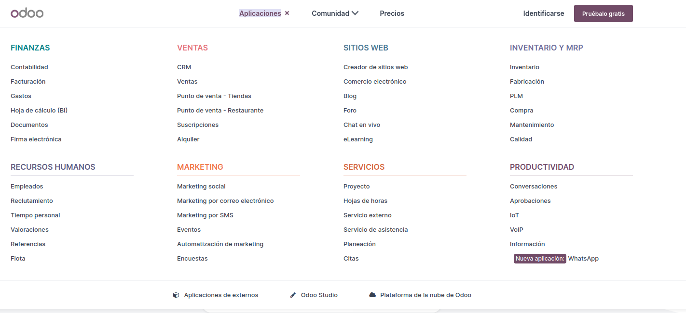
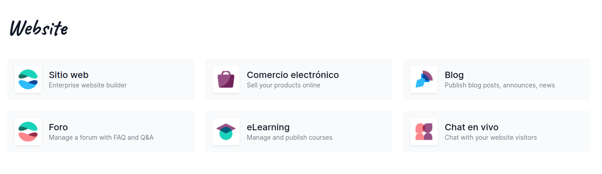

<h1>Trabajo de investigación Odoo</h1>

**Adonay Gonzalez Gutiérrez**

<h1>Indice</h1>

- [Que es Odoo](#que-es-odoo)
- [Para que se usa Odoo](#para-que-se-usa-odoo)
- [Porque usar Odoo](#porque-usar-odoo)
- [Ventajes de Odoo](#ventajes-de-odoo)
- [Desventajas de Odoo](#desventajas-de-odoo)

# Que es Odoo

**¿Qué es Odoo y para que sirve?**

Odoo permite al usuario utilizar bajo una misma plataforma diferentes funcionalidades de software empresarial como CRM, ventas, inventario, informes, contabilidad, envío de facturas, web, e-commerce, e-mail marketing y muchas más. Todas las aplicaciones de Odoo están totalmente integradas y se comunican entre sí.

# Para que se usa Odoo

Odoo como software de gestión empresarial (ERP) se encarga de integrar todas las áreas de tu empresa por medio de módulos o aplicaciones también conocidas como Odoo Apps las cuales se relacionan, facilitan y complementan el proceso de gestión de tu empresa.

En la Captura de pantalla podemos observar todas las aplicacciones que no puedo ofreccer Odoo como ERP. 

# Porque usar Odoo

Tode depende de nuestro modelo de negocio, pero el ambito empresarial esta en constante evolucion y ser una empresa competente hoy en dia es muy complicado, Odoo con sus diferentes te permite bajo un mismo sofware tener todo tipo de aplicaciones que te permiten mejorar, tu modelo de negocio. Odoo posea app para todo tipos de negocios. por ejemplo E-comerce, Paginas Webs ...

Todas estas herramenientas te permiten tener un facil acceso a base de datos, stats sobre ventas y todo lo que quieras implementar para tu negocio.
Odoo cubre todas las necesidades de gestión empresarial a través de los diferentes módulos:

- Inventario
- Ventas
- CRM
- Contabilidad
- Gestión de proyectos
- Facturación
- Compras
- Sitio web

# Ventajes de Odoo

# Desventajas de Odoo